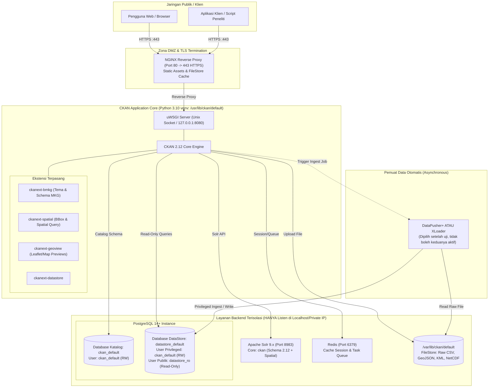

# System Architecture Document (SAD) & Technical Specification
## Portal Open Data BMKG — CKAN 2.12 Native Deployment

| Parameter Arsitektur | Spesifikasi |
| :--- | :--- |
| **Sistem Operasi** | Ubuntu 22.04 LTS (x86_64) — WSL2 untuk dev lokal & Ubuntu Server untuk produksi |
| **Metode Deployment** | **Native Ubuntu (Tanpa Docker)** |
| **Web Server & Gateway** | NGINX (Reverse Proxy & TLS Termination) + uWSGI Application Server |
| **Aplikasi Inti** | CKAN 2.12.0 (Stable, pinned version) |
| **Runtime Environment** | Python 3.10 dalam Virtual Environment (`/usr/lib/ckan/default`) |
| **Database Katalog** | PostgreSQL 14+ (Database: `ckan_default`) |
| **Database DataStore** | PostgreSQL 14+ terpisah (Database: `datastore_default`, ekstensi `postgis`) |
| **Mesin Pencari** | Apache Solr 9.x dengan Schema CKAN 2.12 & Spatial Extension |
| **Antrian & Cache** | Redis 6/7 (Localhost only) |
| **Loader DataStore** | DataPusher+ atau XLoader (diuji terpisah, larangan aktivasi bersamaan) |
| **Ekstensi Geospasial** | `ckanext-spatial` (Spatial search/harvesting) + `ckanext-geoview` (Preview peta) |
| **Kustomisasi BMKG** | `ckanext-bmkg` (Tema Satu Data BMKG + Metadata Schema MKG) |

---

## 1. Diagram Topologi Sistem



---

## 2. Struktur Tata Letak File & Direktori (Filesystem Standard)

Sesuai aturan keselamatan nomor 1 & 2:
- Python sistem Ubuntu `/usr/bin/python3` tidak boleh diubah atau dicemari paket luar.
- Seluruh instalasi CKAN dan dependensi Python berada di dalam Virtual Environment terpisah:

```text
/usr/lib/ckan/default/               <- Virtual Environment Python 3.10
├── bin/                             <- ckan, pip, python, uwsgi
├── lib/python3.10/site-packages/    <- ckan 2.12.0, ckanext-*
└── src/                             <- Source repository ekstensi lokal
    └── ckanext-bmkg/                <- Repository Git tema & skema BMKG

/etc/ckan/default/                   <- Konfigurasi Sistem (Root Owned, Chmod 640/ckan:www-data)
├── ckan.ini                         <- File konfigurasi utama (DI-IGNORE DARI GIT!)
├── who.ini                          <- Konfigurasi autentikasi Repoze.who
└── uwsgi.ini                        <- Konfigurasi socket uWSGI

/var/lib/ckan/default/               <- Storage Data (FileStore & Unggahan Dataset)
└── resources/                       <- Berkas yang diunggah pengguna (CSV, PDF, GeoJSON)

/var/log/ckan/                       <- Logging Terpusat
├── ckan.log                         <- Log aplikasi CKAN
├── uwsgi.log                        <- Log uWSGI
└── loader.log                       <- Log DataPusher+ / XLoader
```

---

## 3. Desain Database & Prinsip Pemisahan Hak Akses (Principle of Least Privilege)

### 3.1 Database Katalog (`ckan_default`)
- Menyimpan entitas paket data (dataset), sumber daya (resource), grup/pilar BMKG, organisasi (stasiun/balai), tag, pengguna, dan log aktivitas audit.
- **User Database:** `ckan_default`
- **Hak Akses:** Penuh (Owner) pada database `ckan_default`.

### 3.2 Database DataStore (`datastore_default`)
- Menyimpan data tabular per-baris yang diurai dari file CSV/XLSX untuk diakses via API.
- **User Privileged (Write/Loader):** `ckan_default`
  - Memiliki hak membuat tabel, indexing, dan memasukkan data via loader.
- **User Publik (Read-Only):** `datastore_ro`
  - **Hanya memiliki izin `SELECT`** pada tabel di skema publik DataStore.
  - Izin `CREATE`, `DROP`, `ALTER`, `INSERT`, `UPDATE`, `DELETE` dicabut secara mutlak.
  - Mencegah serangan *SQL injection* atau eskalasi hak istimewa melalui API `datastore_search_sql`.

---

## 4. Evaluasi Loader Otomatis: DataPusher+ vs XLoader

Aturan runbook menyatakan: **DataPusher klasik deprecated**, dan **hanya satu loader yang boleh aktif pada satu waktu**.

| Kriteria | DataPusher+ | XLoader | Rekomendasi Uji BMKG |
| :--- | :--- | :--- | :--- |
| **Arsitektur** | Service web Python mandiri (Flask/QStash) | Plugin CKAN internal yang memanfaatkan PostgreSQL `COPY` | XLoader jauh lebih cepat untuk tabular besar, DataPusher+ unggul dalam sanitasi tipe data fleksibel |
| **Kecepatan Ingest** | Sedang (Batch insert dengan type guessing canggih) | Sangat Cepat (Streaming direct ke PostgreSQL) | Dataset time-series iklim harian BMKG memiliki ribuan baris, XLoader sangat efisien |
| **Dependensi Tambahan** | Perlu daemon web service terpisah | Membutuhkan Redis worker (`ckan jobs worker`) | XLoader lebih ramping karena Redis sudah ada dalam stack arsitektur |
| **Keputusan Uji (Fase 5)** | Diuji pada Fase 5 menggunakan dataset CSV observasi BMKG standar | Diuji pada Fase 5 menggunakan dataset CSV observasi BMKG standar | Pilih pemenang terbaik berdasarkan stabilitas memori & akurasi tipe data |

---

## 5. Integrasi Geospasial (`ckanext-spatial` & `ckanext-geoview`)

Sesuai catatan arsitektur: **Pencarian spasial dan pratinjau sumber daya (preview) adalah dua fungsi yang sepenuhnya berbeda**:

1. **Pencarian Spasial (`ckanext-spatial`):**
   - Menggunakan ekstensi PostgreSQL `PostGIS` pada basis data.
   - Melakukan ekstraksi geometri Bounding Box (BBox) dari metadata dataset saat dibuat/diupdate.
   - Mengirim koordinat BBox ke Apache Solr 9 (`spatial_geom` field) sehingga pengguna dapat memfilter dataset berdasarkan poligon peta atau area geografis (misal: Selat Sunda, Jawa Barat, atau BBox Nasional RI).
2. **Pratinjau Geospasial (`ckanext-geoview`):**
   - Merupakan modul frontend berbasis Leaflet / OpenLayers.
   - Mengambil file sumber daya spasial (GeoJSON, KML, Shapefile via WFS/GeoServer atau GeoJSON langsung) dan menampilkannya sebagai peta interaktif interaktif di tab pratinjau CKAN tanpa membebani indeks Solr.

---

## 6. Sembilan Aturan Keselamatan & Enforce Teknis

| No | Aturan Keselamatan | Implementasi Teknis |
| :---: | :--- | :--- |
| 1 | **Jangan menjalankan CKAN atau pip sebagai root** | Semua instalasi dijalankan oleh user standar (misal: `ckan` / user WSL2 non-root) dengan virtualenv. |
| 2 | **Jangan memasang dependensi CKAN ke Python sistem** | Selalu aktifkan venv: `source /usr/lib/ckan/default/bin/activate` sebelum mengeksekusi `pip install`. |
| 3 | **Jangan memakai latest, branch master, atau unpinned dependencies** | File `requirements.txt` dan paket CKAN wajib menggunakan versi spesifik: `ckan==2.12.0`. |
| 4 | **Jangan menyimpan password, API token, ckan.ini produksi di Git** | File `.gitignore` ketat dipasang di root repo; kredensial produksi menggunakan environment injection atau file `ckan.ini` chmod 600 di server. |
| 5 | **PostgreSQL, Redis, Solr, dan uWSGI hanya listen pada localhost/private** | `postgresql.conf` -> `listen_addresses = 'localhost'`; `redis.conf` -> `bind 127.0.0.1`; Solr jetty binding ke `127.0.0.1:8983`; uWSGI via unix socket atau loopback. |
| 6 | **DataStore memisahkan akun read-only dan write-only** | Konfigurasi `ckan.datastore.write_url` menggunakan `ckan_default` dan `ckan.datastore.read_url` menggunakan `datastore_ro`. |
| 7 | **Jangan mengaktifkan DataPusher klasik & jangan aktifkan DataPusher+ bersamaan XLoader** | Variabel `ckan.plugins` hanya boleh memuat salah satu: `datapusher_plus` ATAU `xloader`. |
| 8 | **Backup database dan FileStore harus diuji dengan proses restore** | Script backup berkala wajib disertai prosedur `restore_test.sh` ke database staging terisolasi. |
| 9 | **Perintah instalasi dijalankan per fase setelah pemeriksaan sebelumnya lulus** | Melakukan verifikasi exit gate (Fase 0 hingga 7) sebelum beralih ke tahapan berikutnya. |
